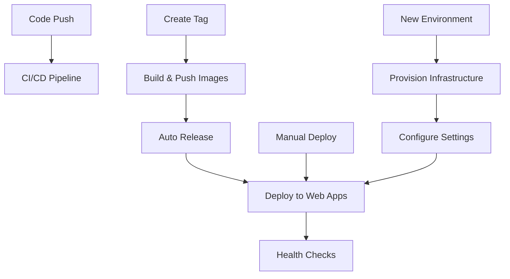

# Deployment Workflows

This document describes the streamlined deployment workflows for the AmLink Submissions MCP project.

## Workflow Overview

### 🏗️ Core Workflows

1. **CI/CD Pipeline** (`ci-cd.yml`)
   - Runs on every push and PR
   - Builds, tests, and validates code
   - Security scanning with Trivy

2. **Build & Push** (`build-and-push.yml`)
   - Builds and publishes container images
   - Triggered by tags and manual dispatch
   - Publishes to GitHub Container Registry

3. **Auto Release** (`auto-release.yml`)
   - Creates GitHub releases from tags
   - Waits for container images to be built
   - Generates release notes automatically

4. **Deploy to Web Apps** (`deploy-webapps.yml`) ⭐
   - Deploys containers to Azure Web Apps for Containers
   - Automatic deployment on releases
   - Manual deployment with custom parameters
   - Health checks and verification

5. **Provision Infrastructure** (`provision-infrastructure.yml`) ⭐
   - Creates new Azure Web Apps environments
   - Sets up resource groups and App Service plans
   - Basic configuration for new deployments

### 🚀 Deployment Flow

## Usage

### Deploying to Existing Environment

**Automatic (Recommended):**
1. Create a new tag: `git tag v1.0.0 && git push origin v1.0.0`
2. Workflows automatically: Build → Release → Deploy to staging

**Manual:**
1. Go to Actions → "Deploy to Web Apps for Containers"
2. Click "Run workflow"
3. Select environment and image tag
4. Click "Run workflow"

### Setting Up New Environment

1. Go to Actions → "Provision Web Apps Infrastructure"
2. Click "Run workflow"
3. Select environment (staging/production) and Azure region
4. Click "Run workflow"
5. After completion, configure environment-specific settings in Azure portal

### Current Environments

- **Staging**: `rg-amlink-submissions-mcp-staging`
  - Client: https://app-amlink-submissions-mcp-staging-client.azurewebsites.net
  - Server: https://app-amlink-submissions-mcp-staging-server.azurewebsites.net

- **Production**: Not yet provisioned
  - Use "Provision Infrastructure" workflow to create

## Configuration Requirements

### GitHub Secrets

The following secrets must be configured in the repository:

- `AZURE_CLIENT_ID`: Service principal client ID
- `AZURE_CLIENT_SECRET`: Service principal client secret  
- `AZURE_TENANT_ID`: Azure tenant ID
- `AZURE_SUBSCRIPTION_ID`: Azure subscription ID
- `GITHUB_TOKEN`: Automatically provided by GitHub

### Azure Service Principal Permissions

The service principal needs the following permissions:
- **Contributor** role on the subscription or resource group
- **Access to GitHub Container Registry** for pulling images

## Environment Variables

The deployment workflows preserve all existing application settings. For new environments, you'll need to manually configure:

### Client App Settings
- `IdentityServer__*`: Identity Server configuration
- `McpServer__*`: MCP server URLs
- `OPENAI_API_KEY`: OpenAI API key

### Server App Settings  
- `IdentityServer__*`: Identity Server configuration
- `ExternalApis__*`: External API configurations

## Troubleshooting

### Authentication Failures
- Verify service principal secrets are correct
- Check service principal has Contributor role
- Ensure subscription ID is correct

### Container Image Issues
- Verify images exist in GitHub Container Registry
- Check image tags match the deployment version
- Ensure GITHUB_TOKEN has package read permissions

### Health Check Failures
- Applications may take 1-2 minutes to fully start
- Check application logs in Azure portal
- Verify environment variables are correctly set

## Migration Notes

### From Previous Workflows
- `azure-deploy.yml` (Container Apps) → Removed
- `webapp-update.yml` (Broken auth) → Replaced with `deploy-webapps.yml`
- `release.yml` (Complex) → Simplified to `auto-release.yml`
- `deployment-validation.yml` → Integrated into `deploy-webapps.yml`

### Key Improvements
- ✅ Reliable Azure authentication
- ✅ Environment variable preservation  
- ✅ Health checks and verification
- ✅ Comprehensive reporting
- ✅ Support for both staging and production
- ✅ Manual and automatic deployment modes