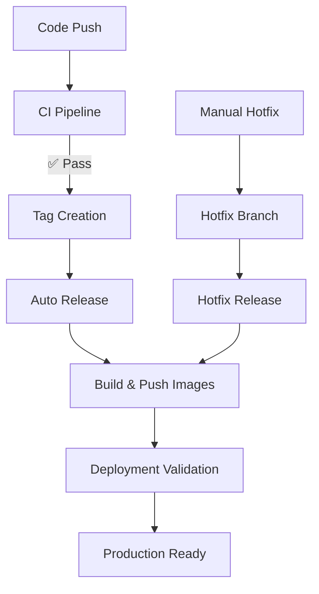

# Release Pipeline Documentation

This document outlines the complete release pipeline system for AmLink Submissions MCP, designed to provide automated, secure, and reliable release management.

## 🎯 Release Pipeline Overview

Our release system uses a **multi-stage approach** with automated validation, container publishing, and deployment capabilities:



## 📋 Available Workflows

### 1. **Auto Release from Tag** (`auto-release.yml`)

**Purpose**: Automatically creates GitHub releases when version tags are pushed

**Triggers:**

- Push tags matching `v*` (e.g., `v0.0.1`, `v1.2.3`, `v2.0.0-beta`)

**Features:**

- ✅ Automatic release notes generation
- ✅ Categorized commit messages (features, fixes, CI/CD)
- ✅ Contributor attribution
- ✅ Pre-release detection (`v1.0.0-alpha`, `v1.0.0-beta`)
- ✅ Deployment instructions included

**Usage:**

```bash
# Create and push a version tag
git tag v1.0.0 -m "Release version 1.0.0"
git push origin v1.0.0
```

### 2. **Build and Push Container Images** (`build-and-push.yml`)

**Purpose**: Publishes validated container images to the registry

**Triggers:**

- Version tags (`v*`)
- Manual workflow dispatch
- GitHub releases

**Features:**

- ✅ CI status validation (ensures tests passed)
- ✅ Multi-architecture builds (AMD64, ARM64)
- ✅ Container security scanning
- ✅ Intelligent tagging strategy
- ✅ GitHub Container Registry integration

### 3. **Deployment Validation** (`deployment-validation.yml`)

**Purpose**: Tests container images in a realistic deployment environment

**Triggers:**

- Manual workflow dispatch

**Features:**

- ✅ Image existence verification
- ✅ Security vulnerability scanning
- ✅ Full deployment testing with Docker Compose
- ✅ Health check validation
- ✅ Connectivity testing
- ✅ Detailed logging and artifact collection

**Usage:**

```bash
# Validate a specific image tag
# Go to GitHub Actions → "Deployment Validation" → Run workflow
# Enter image tag (e.g., "v1.0.0") and environment
```

### 4. **Hotfix Release** (`hotfix.yml`)

**Purpose**: Creates hotfix branches and manages emergency releases

**Triggers:**

- Manual workflow dispatch

**Features:**

- ✅ Automated hotfix branch creation
- ✅ Version validation
- ✅ Structured hotfix workflow
- ✅ Integration with main release pipeline

**Usage:**

```bash
# Create a hotfix via GitHub Actions
# Go to Actions → "Hotfix Release" → Run workflow
# Enter hotfix version (e.g., "v1.0.1") and description
```

## 🚀 Complete Release Process

### **Standard Release (Feature/Maintenance)**

1. **Development & Testing**

   ```bash
   # Make changes on feature branch
   git checkout -b feature/new-feature
   # ... make changes ...
   git commit -m "feat: add new feature"
   git push origin feature/new-feature
   ```

2. **Create Pull Request**
   - CI pipeline validates changes
   - Security scanning runs
   - Code review process

3. **Merge to Main**

   ```bash
   # After PR approval and merge
   git checkout main
   git pull origin main
   ```

4. **Create Release**

   ```bash
   # Tag the release
   git tag v1.1.0 -m "Release v1.1.0 - New features and improvements"
   git push origin v1.1.0
   ```

5. **Automated Process**
   - 🏷️ Auto-release workflow creates GitHub release
   - 🐳 Build & Push workflow publishes images
   - 📋 Release notes generated automatically
   - 🔒 Security scanning of published images

### **Hotfix Release (Emergency)**

1. **Create Hotfix Branch**
   - Go to Actions → "Hotfix Release"
   - Enter version (e.g., `v1.0.1`) and description
   - Automated branch creation

2. **Apply Fix**

   ```bash
   git checkout hotfix/v1.0.1
   # ... apply critical fix ...
   git commit -m "fix: critical security vulnerability"
   git push origin hotfix/v1.0.1
   ```

3. **Create PR and Merge**
   - Fast-track review process
   - Merge to main branch

4. **Release**

   ```bash
   # Tag the hotfix
   git tag v1.0.1 -m "Hotfix v1.0.1 - Critical security fix"
   git push origin v1.0.1
   ```

### **Pre-Release/Beta Testing**

1. **Create Pre-release Tag**

   ```bash
   git tag v2.0.0-beta -m "Beta release v2.0.0-beta"
   git push origin v2.0.0-beta
   ```

2. **Validate Deployment**
   - Use "Deployment Validation" workflow
   - Test in staging environment
   - Collect feedback

3. **Promote to Stable**

   ```bash
   git tag v2.0.0 -m "Stable release v2.0.0"
   git push origin v2.0.0
   ```

## 🔧 Configuration & Customization

### **Environment Variables**

```yaml
# Global settings
REGISTRY: ghcr.io
IMAGE_NAME: ${{ github.repository }}

# Deployment validation
ENVIRONMENT: staging  # or test, demo
```

### **Tagging Strategy**

- **Stable releases**: `v1.0.0`, `v1.2.3`
- **Pre-releases**: `v1.0.0-alpha`, `v1.0.0-beta`, `v1.0.0-rc1`
- **Hotfixes**: `v1.0.1`, `v1.0.2`

### **Release Notes Categories**

- ✨ **Features**: `feat:` commits
- 🐛 **Bug Fixes**: `fix:` commits  
- 🔧 **CI/CD**: `ci:` commits
- 🔄 **Other Changes**: All other commits

## 📊 Monitoring & Observability

### **Workflow Artifacts**

- 🔒 Security scan results
- 📋 Deployment logs
- 🧪 Test results
- 📦 Deployment packages

### **GitHub Integration**

- 📈 Release metrics in GitHub Insights
- 🔒 Security alerts in Security tab
- 📦 Container images in Packages
- 📋 Workflow status in Actions

### **Notifications**

- ✅ Successful releases
- ❌ Failed deployments
- 🔒 Security vulnerabilities
- 📦 New image versions

## 🛡️ Security & Compliance

### **Security Scanning**

- **Source code**: Trivy filesystem scanning
- **Container images**: Trivy image scanning
- **Dependencies**: Automated vulnerability detection
- **Secrets**: GitHub secret scanning

### **Access Control**

- **Repository permissions**: Write access for releases
- **Package registry**: Automated publishing
- **Workflow triggers**: Protected branch rules

### **Audit Trail**

- **Git tags**: Immutable release markers
- **Workflow logs**: Complete deployment history
- **Artifacts**: Evidence of security scans
- **Release notes**: Change documentation

## 🚦 Troubleshooting

### **Common Issues**

**Release Creation Failed**

```bash
# Check if tag already exists
git tag -l | grep v1.0.0

# Check CI status
# Ensure main CI pipeline passed before release
```

**Image Publishing Failed**

```bash
# Check registry permissions
# Verify GITHUB_TOKEN has packages:write permission

# Check image build logs
# Review Docker build process in workflow
```

**Deployment Validation Failed**

```bash
# Check image availability
docker manifest inspect ghcr.io/owner/repo:tag

# Review health check endpoints
curl -f http://localhost:8080/health
```

**Hotfix Process Issues**

```bash
# Ensure proper version format
# Use semantic versioning: v1.0.1

# Check branch naming
# Should be: hotfix/v1.0.1
```

## 📈 Best Practices

### **Version Management**

- 🔢 Use semantic versioning (MAJOR.MINOR.PATCH)
- 📝 Write descriptive commit messages
- 🏷️ Tag releases consistently
- 📋 Maintain changelog

### **Testing Strategy**

- ✅ Run full CI before releases
- 🧪 Use deployment validation for major releases
- 🔄 Test rollback procedures
- 📊 Monitor post-deployment metrics

### **Documentation**

- 📖 Keep release notes updated
- 🔗 Include deployment instructions
- 📚 Document breaking changes
- 🎯 Highlight new features

### **Security**

- 🔒 Scan all releases for vulnerabilities
- 🔐 Use secure container base images
- 📋 Review security reports
- ⚡ Apply security patches quickly

---

This release pipeline provides a robust, automated, and secure release management system that scales with your development workflow while maintaining high quality and security standards.
